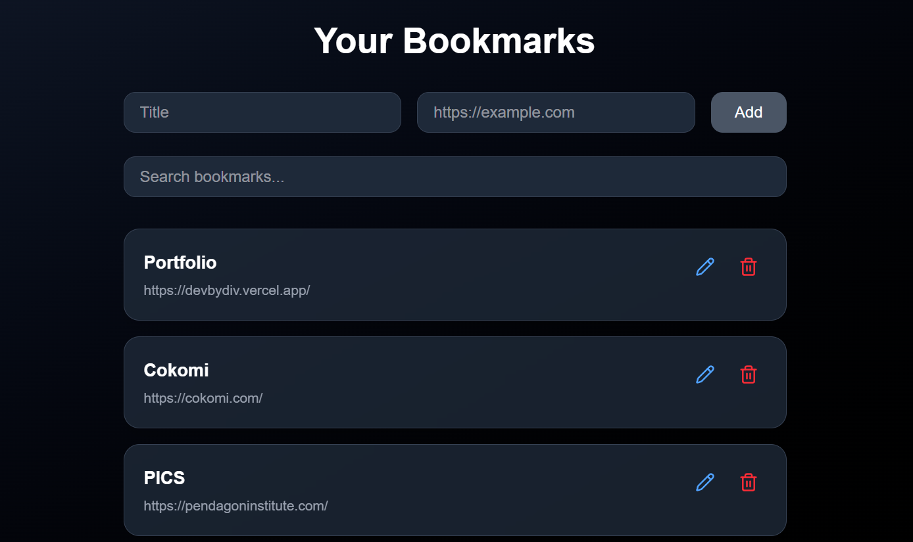
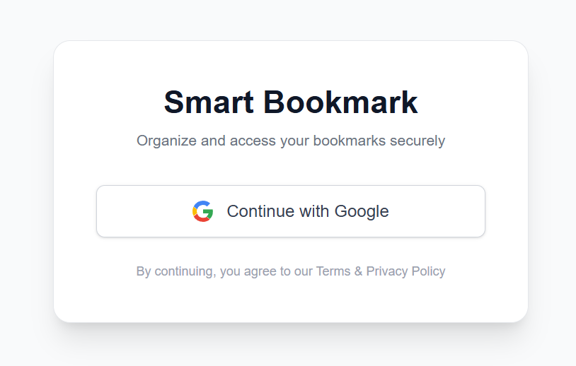

# 🔖 Realtime Bookmark Manager

A production-ready fullstack bookmark management application built with **Next.js + Supabase**, featuring secure authentication, realtime synchronization, inline editing, instant search filtering, and polished UX.
A production-ready fullstack bookmark management application built with **Next.js + Supabase**, featuring secure authentication, realtime synchronization, inline editing, instant search filtering, and polished UX.

---

## 🚀 Live Demo

🔗 https://smart-bookmark-inky.vercel.app/
🔗 https://smart-bookmark-inky.vercel.app/

## 📂 Repository

🔗 https://github.com/Divij860/Smart-Bookmark

---

## 📸 Screenshots

### 🖥 Dashboard


### 🔐 Login


---

# 📌 Project Overview

This application allows authenticated users to securely manage personal bookmarks in a realtime environment.
This application allows authenticated users to securely manage personal bookmarks in a realtime environment.

### ✨ Users Can:
### ✨ Users Can:

- ➕ Add bookmarks  
- ✏ Edit bookmarks inline  
- 🗑 Delete bookmarks  
- 🔎 Search bookmarks instantly  
- 🔄 See realtime updates across multiple tabs  
- 📱 Use the app seamlessly on mobile  
- ✨ Experience smooth animations and polished interactions  

---

# 🎯 Project Focus

This project was built with strong emphasis on:
- 📱 Use the app seamlessly on mobile  
- ✨ Experience smooth animations and polished interactions  

---

# 🎯 Project Focus

This project was built with strong emphasis on:

- ✅ Correctness  
- 🔒 Security  
- ⚡ Performance  
- 🎨 User Experience  
- 🏗 Production-level architecture  
- 🏗 Production-level architecture  

---

# 🛠 Tech Stack

## 🎨 Frontend

- Next.js (App Router)
- React
- TypeScript
- TailwindCSS
- Framer Motion
- React Hot Toast
- Lucide Icons

## 🗄 Backend

- Supabase
- PostgreSQL
- Authentication
- Realtime Subscriptions
- Realtime Subscriptions
- Row Level Security (RLS)

---

# 🧠 Architecture Decisions

## 1️⃣ Optimized Realtime State Management

Instead of refetching the entire bookmarks table on every realtime event, the application listens to Supabase `postgres_changes` and updates local state selectively:

- `INSERT` → Prepend to state  
- `DELETE` → Remove from state  
- `UPDATE` → Merge updated record  
- `INSERT` → Prepend to state  
- `DELETE` → Remove from state  
- `UPDATE` → Merge updated record  

### Why This Matters
### Why This Matters

- Reduced database reads  
- Better scalability  
- Faster UI updates  
- More efficient state handling  
- Production-grade realtime architecture  
- Faster UI updates  
- More efficient state handling  
- Production-grade realtime architecture  

---

## 2️⃣ Secure Row Level Security (RLS)

RLS is enabled on the `bookmarks` table to guarantee strict user data isolation.
RLS is enabled on the `bookmarks` table to guarantee strict user data isolation.

### Implemented Policies:
### Implemented Policies:

- **SELECT** → `auth.uid() = user_id`
- **INSERT** → `auth.uid() = user_id`
- **UPDATE** → `auth.uid() = user_id`
- **DELETE** → `auth.uid() = user_id`

This ensures users can only access and modify their own data.
This ensures users can only access and modify their own data.

---

## 3️⃣ Realtime Configuration

To ensure `UPDATE` and `DELETE` events broadcast correctly:

```sql
ALTER TABLE public.bookmarks REPLICA IDENTITY FULL;
```

This allows old row data to be included in realtime payloads.

---

## 4️⃣ Why Supabase?

Supabase was chosen for:

- Integrated authentication
- Managed PostgreSQL
- Built-in realtime subscriptions
- Minimal infrastructure overhead
- Strong security model with RLS

It enabled rapid development without sacrificing backend robustness.

---

# 🎨 UX & Product Considerations

The application includes several production-level UX improvements:

- 💀 Skeleton loading states  
- ✨ Smooth enter/exit animations  
- ✏ Inline editing mode  
- 🔎 Memoized live search filtering  
- 📎 Overflow-safe URL handling  
- 🔔 Toast notifications  
- 📱 Fully responsive layout  
- ⚡ Optimistic-feel UI updates  

---

# 📊 Features

- 🔐 Secure authentication  
- 🔄 Realtime sync across multiple tabs  
- ✏ Inline edit mode  
- 🔎 Instant search filtering  
- 🗑 Delete functionality  
- ✨ Smooth animations  
- 💀 Loading skeleton  
- 📱 Responsive design  
- 🔒 Strict RLS security  

---

# 🧩 Challenges & Solutions

During development, several architectural and debugging challenges were resolved.

---

## 🔴 1. Realtime DELETE Not Updating Instantly

**Problem:**  
Delete events were not reflected immediately in the UI.

**Root Cause:**  
Supabase Realtime requires proper replication settings for `DELETE` and `UPDATE`.

**Solution:**
```sql
ALTER TABLE public.bookmarks REPLICA IDENTITY FULL;
```

---

## 🔴 2. UPDATE Failing Silently

**Problem:**  
Editing bookmarks did not persist changes.

**Root Cause:**  
Missing UPDATE policy under Row Level Security.

**Solution:**
```sql
create policy "Users can update own bookmarks"
on public.bookmarks
for update
using (auth.uid() = user_id)
with check (auth.uid() = user_id);
```

---

## 🔴 3. Realtime UPDATE Not Reflecting in UI

**Problem:**  
Database updated, but UI did not refresh properly.

**Root Cause:**  
State was not being merged correctly.

**Solution:**
```ts
setBookmarks(prev =>
  prev.map(b =>
    b.id === payload.new.id
      ? { ...b, ...payload.new }
      : b
  )
);
```

---

## 🔴 4. Long URLs Breaking Layout

**Problem:**  
Long URLs overflowed card width and broke layout.

**Root Cause:**  
Flex children without `min-w-0` do not shrink properly.

**Solution:**
```tsx
className="flex-1 min-w-0"
className="break-all"
```

---

## 🔴 5. Edit Buttons Triggering Unexpected Behavior

**Problem:**  
Edit button caused unintended form submission.

**Root Cause:**  
Buttons default to `type="submit"` inside forms.

**Solution:**
```tsx
type="button"
```

---

## 🔴 6. Inefficient Refetching on Realtime Events

**Problem:**  
Entire table was refetched after every realtime event.

**Issue:**  
This approach does not scale.

**Solution:**  
Refactored to mutate state locally based on event type.

Result:
- Reduced database load
- Improved responsiveness
- Scalable realtime handling

---

# 📦 Database Schema

```sql
create table public.bookmarks (
  id uuid not null default extensions.uuid_generate_v4(),
  user_id uuid references auth.users(id) on delete cascade,
  title text not null,
  url text not null,
  created_at timestamp with time zone default now(),
  primary key (id)
);
```

---

# ⚖ Tradeoffs

- Search is client-side for simplicity. Large datasets should use DB filtering with pagination.
- Bookmark metadata fetching was not implemented to maintain scope focus.
- Global state management was avoided due to limited application scale.

---

# 🔮 Future Improvements

- Next.js middleware route protection
- Pagination
- Debounced search
- Tagging system
- Metadata preview fetching
- Unit & integration testing
- Shared bookmarks
- AI-powered bookmark summaries (GenAI extension)

---

# 🧪 Running Locally

### 1️⃣ Clone Repository

```bash
git clone https://github.com/Divij860/Smart-Bookmark
```

### 2️⃣ Install Dependencies

```bash
npm install
```

### 3️⃣ Create `.env.local`

```env
NEXT_PUBLIC_SUPABASE_URL=your_url
NEXT_PUBLIC_SUPABASE_ANON_KEY=your_key
```

### 4️⃣ Run Development Server

```bash
npm run dev
```

---

# 🏁 Conclusion

This project demonstrates:

- 🔒 Secure backend configuration with strict RLS
- 🔄 Efficient realtime state management
- 🧠 Deep debugging and architectural reasoning
- ⚡ Performance-aware design decisions
- 🎨 Production-level UX polish
- 🏗 Strong fullstack system understanding

It was built with attention to production-level concerns — not just functional completion.

---

## 👨‍💻 Author

**Divij P**  
Fullstack Engineer (MERN + Next.js)  
Focused on scalable, secure, and performant web applications.